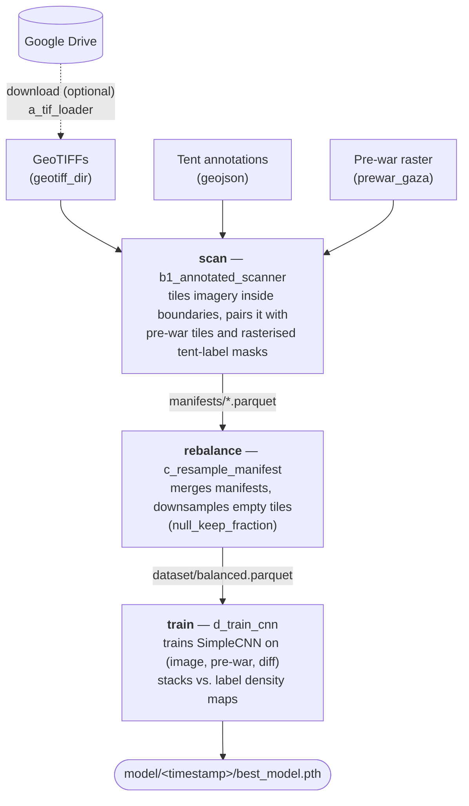
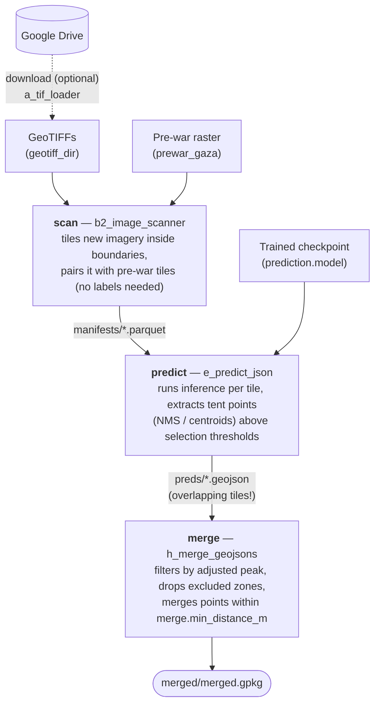

# Gaza Strip Tent Detection (TentNetFA)

> A fork from https://github.com/algorithmicgovernance/TentNetFA

This project processes high-resolution Planet satellite images of the Gaza Strip in combination with historic tent locations identified by **Forensic Architecture** — a multidisciplinary research group based at Goldsmiths, University of London.

---

## Overview

The goal of this work is to develop a convolutional neural network (CNN) that can predict, at the pixel level, the locations of tents in the Gaza Strip from satellite imagery. These predictions use Gaussian densities to create highly granular maps of displacement patterns over time.

This automated detection supports population nowcasting in the Gaza strip in collaboration with the United Nations, Acted, IMPACT, and other partners integrating privacy-preserving telecommunications data and other geospatial data sources related to real-time population movements (see [Gaza NowPop](https://github.com/realgoodresearch/GazaNowPop)). 

---

## Key Features

-   **Data Ingestion**: Processes Planet GeoTIFF satellite images and GeoJSON files containing labeled tent locations.
-   **Data Processing**:
    -   Scans satellite imagery based on geographic coordinates to extract image tiles.
    -   Generates paired datasets of image patches and corresponding label masks indicating tent locations.
    -   Creates HDF5 datasets for efficient handling during training.
-   **Model Training**: Trains a custom CNN (`SimpleCNN`) for pixel-wise semantic segmentation to predict tent presence as a density map.
-   **Prediction & Evaluation**:
    -   Generates GeoJSON point clouds of predicted tent locations from new satellite imagery.
    -   Includes tools for evaluating prediction accuracy against ground truth data and for performing spatial validation analysis.

---

## Installation

This project uses Poetry for dependency management. Ensure you have Python 3.10+ installed.

1.  **Clone the repository:**
    ```bash
    git clone https://github.com/realgoodresearch/TentNetFA.git
    cd TentNetFA
    ```

2.  **Install dependencies using Poetry:**
    ```bash
    poetry install
    ```
    Alternatively, you can install from the `requirements.txt` file, although this is not the recommended method:
    ```bash
    pip install -r requirements.txt
    ```

3.  **Set up environment variables:**
    Create a `.env` file in the project root to store necessary credentials, such as your `GOOGLE_API_KEY` and the Google Drive folder ID (`GDRIVE_ID`) for downloading satellite imagery.

    ```
    GOOGLE_API_KEY="your_api_key_here"
    GDRIVE_ID="your_folder_id_here"
    DATA_DIR="/path/to/your/data"

### Updating requirements.txt

If you modify dependencies in `pyproject.toml`, you must regenerate the `requirements.txt` file:
```bash
poetry export -f requirements.txt --output requirements.txt --without-hashes
```

on a regular basis.


## Interactive Pipelines (recommended)

The individual stages below can also be run end-to-end through the pipeline runner, which handles config resolution and artifact layout for you. Every pipeline run creates a self-contained directory with fixed subfolder names:

```
<run root>/<pipeline>/<run name>/
    config.yaml     # fully resolved config used by all stages
    logs/           # one log file per stage
    manifests/ preds/ merged/    # prediction pipeline
    manifests/ dataset/ model/   # training pipeline
```

The run root defaults to `${DATA_DIR}/results/TentNetFA/pipeline_runs`; the run name defaults to a timestamp.

Both pipelines include an optional (default-off) download stage that fetches newly arrived GeoTIFFs from Google Drive into `geotiff_dir` before scanning, using the `loading.files` entries as search strings (requires `GOOGLE_API_KEY` and `GDRIVE_ID` in `.env`).

### Pipeline stages

Training pipeline (the `train` section of `config.yaml`):



Prediction pipeline (the `predict` section of `config.yaml`):



The same diagrams, together with a full reference of every config key, are available in the UI's **Help** tab (sourced from [`displacement_tracker/pipelines/help.md`](displacement_tracker/pipelines/help.md)).

### Browser UI

```bash
poetry install --with ui   # installs streamlit
poetry run pipeline-ui
```

This starts a local web server and opens a browser session where you pick the pipeline (training or prediction), override any parameter from the matching section of `config.yaml` in a form (plus a free-form YAML box for anything not exposed), toggle individual stages, and watch live logs while the run executes.

A run is tied to its browser session: switching pipeline, refreshing or closing the page cancels the running stage and terminates all of its child processes. Completed artifacts and per-stage logs remain in the run directory, so you can resume by re-running with only the remaining stages enabled. For long unattended runs prefer the headless CLI below inside tmux/screen.

Extra arguments are passed through to `streamlit run` (e.g. `--server.port 8501`).

#### Running on a remote machine (SSH tunnel)

Pipelines will typically run on a remote GPU machine. The UI is just a web server on that machine, so start it there and forward the port to your local browser:

```bash
# on the remote, inside the repo (tmux/screen recommended: the pipeline
# stages are children of the UI process and die with your SSH session)
poetry run pipeline-ui --remote

# it prints the matching tunnel command to run on your local machine, e.g.
#     ssh -L 8501:localhost:8501 user@remote
# then open http://localhost:8501 locally
```

`--remote` is shorthand for `--server.headless true --server.address localhost`: no browser is opened on the remote, and the UI is reachable only through the tunnel — recommended, since the UI has no authentication and can launch jobs and write to `DATA_DIR`. Individual flags can still be overridden (e.g. `--remote --server.port 8600`), and whenever an SSH session is detected the tunnel command is printed even without `--remote`. On a trusted LAN you can drop `--remote` and use the "Network URL" streamlit prints instead of a tunnel, but never expose the port to untrusted networks.

After pulling new code (or when a port is stuck), stop any stale backends before restarting:

```bash
poetry run pipeline-ui-stop            # add --dry-run to only list them
```

This gracefully terminates every running `pipeline-ui` server including the pipeline stages it spawned, plus stage processes orphaned by an earlier hard kill. Deliberate headless `pipeline-run` sessions are left untouched.

### Headless CLI

The same orchestration is scriptable without a browser:

```bash
poetry run pipeline-run predict --set prediction.batch_size=16 --name 2026-02-rerun
poetry run pipeline-run train --skip download --set training.epochs=500
poetry run pipeline-run predict --dry-run   # print the plan without executing
```

`--set` takes dotted config paths (`section.key=value`, YAML-parsed); `--only`/`--skip` select stages. Pipeline definitions (stages, exposed parameters, artifact layout) live in `displacement_tracker/pipelines/spec.py`.

## Workflow and CLI Usage

The core workflow is managed through a series of command-line scripts. All scripts read the single `config.yaml`: each resolves its own flow section (`train` or `predict`, deep-merged over `shared`) by default, and accepts `--flow train|predict` to override — e.g. `poetry run image-scanner config.yaml --flow train` to scan training imagery with the image-only scanner.

### 1. Download Satellite Imagery
Download GeoTIFF files from Google Drive based on the filenames specified in your configuration file. The download stage runs in both flows, so tell it which section to use:

```bash
poetry run tif-loader config.yaml --flow train    # or --flow predict
```

### 2. Prepare Training Data
Scan the downloaded GeoTIFFs and corresponding GeoJSON labels (from the `train` section) to build per-image tile manifests for training.

```bash
poetry run annotated-scanner config.yaml
```

### 3. Train the Model
Train the CNN using the generated manifests.

```bash
poetry run train-cnn config.yaml
```
Model checkpoints and training logs will be saved to a timestamped directory inside `runs/`.

### 4. Predict on New Imagery
Use a trained model to predict tent locations on new satellite images, configured by the `predict` section of `config.yaml`.

```bash
poetry run predict-json config.yaml
```
This will generate GeoJSON files containing the coordinates of predicted tents.

### 5. Evaluate and Validate
The repository includes several scripts for analyzing the results:

-   `evaluate-geojson`: Compare a prediction GeoJSON against a ground truth GeoJSON to compute metrics like precision, recall, and F1-score.
-   `validate-geojson`: Perform spatial validation by comparing rasterized prediction counts against validation counts on a master grid.
-   `merge-geojsons`: Merge multiple prediction GeoJSONs into a single, deduplicated GeoPackage file.

---
## Configuration File (config.yaml)

Both flows are configured through the single `config.yaml`, which has three top-level sections:

- **`shared`** — the single source of truth for values used by more than one flow (boundaries, pre-war raster, tile geometry).
- **`train`** — everything the training flow needs (annotated imagery paths, manifests, rebalancing, CNN hyperparameters).
- **`predict`** — everything the prediction flow needs (new imagery paths, model checkpoint, selection/merge parameters).

When a stage runs, its flow section is deep-merged over `shared` (the flow section wins), producing a flat config. This means shared values are defined exactly once, while each flow section makes explicit which paths and parameters its stages use — e.g. `train.geotiff_dir` and `predict.geotiff_dir` are independent keys, but both flows tile imagery with the same `shared.processing.core_metres`.

```yaml
shared:
  boundaries: gaza_boundaries/GazaStrip_MunicipalBoundaries.shp
  prewar_gaza: ${DATA_DIR}/data/prewar_gaza.tif
  processing:
    core_metres: 70     # tile geometry must match between training and prediction
    margin_metres: 15

train:
  geotiff_dir: ${DATA_DIR}/data/training_data/tif_files
  geojson: ${DATA_DIR}/data/training_data/annotations.geojson
  manifest_folder: ${DATA_DIR}/data/training_data/manifests
  processing:
    quality_thresholds:
      min_valid_fraction: 0.9   # strict for training
  rebalancing: { ... }
  training: { ... }

predict:
  geotiff_dir: ${DATA_DIR}/results/TentNetFA/2026-02/tiffs
  manifest_folder: ${DATA_DIR}/results/TentNetFA/2026-02/manifests
  processing:
    quality_thresholds:
      min_valid_fraction: 0.1   # loose for prediction
  prediction: { ... }
```

See the checked-in [`config.yaml`](./config.yaml) for the full set of keys, and the [pipeline help](displacement_tracker/pipelines/help.md) for a reference of what each key does. Flat single-flow configs (the historic `config.yaml` / `predict_config.yaml` layout, and the resolved configs the pipeline runner writes into run directories) are still accepted by every script.

## Prediction Pipeline

Running predictions on new satellite imagery consists of three stages:

1. Process GeoTIFF imagery and generate manifests
2. Run model inference
3. Merge prediction outputs

Example [Collab Notebook](https://colab.research.google.com/drive/1pFXIwNghzgMpnOJng027GLW6LRaRgV91?usp=sharing) to get started.

### Prerequisites

Before running predictions, ensure the following files are available locally:

* GeoTIFF files to be processed
* Gaza Strip boundaries folder including [`GazaStrip_MunicipalBoundaries.shp`](https://drive.google.com/drive/folders/1JXj-MK33lG4RQLnZLZVElYc2cQjPgdjJ?usp=sharing)
* [`prewar_gaza.tif`](https://drive.google.com/file/d/1NyOgmIBv2NqwaG5quXaASuTa3P3pO5qL/view?usp=sharing)

The GeoTIFF files can be stored in any folder structure, provided the correct paths are specified in the configuration files.

---

### Step 1: Process GeoTIFF Imagery

1. Download or copy the GeoTIFF files you want to run predictions on.
2. Store them anywhere within or outside the repository.
3. Update `config.yaml` with:

   * `predict.geotiff_dir`: directory containing the GeoTIFF files
   * `predict.manifest_folder`: directory where manifests should be written
   * `shared.boundaries`: path to `GazaStrip_MunicipalBoundaries.shp`
   * `shared.prewar_gaza`: path to `prewar_gaza.tif`

Run:

```bash
poetry run python -m displacement_tracker.b2_image_scanner config.yaml
```

This command scans all GeoTIFFs in `geotiff_dir` and generates manifests for files that do not already have a corresponding manifest in `manifest_folder`.

---

### Step 2: Run Predictions

Update the `predict` section of `config.yaml` with the correct paths:

* `geotiff_dir`
* `prediction.input_folder`
* `prediction.output_folder`

Recommended selection parameters:

```yaml
prediction:
  selection:
    threshold: 0.0001
    factor: 1.0
    nms_kernel_size: 7
    min_distance_m: 3.0
```

Run:

```bash
poetry run python -m displacement_tracker.e_predict_json config.yaml
```

This command runs inference on all imagery that has a manifest available in the configured manifest folder.

Output files are written as GeoJSON/JSON prediction files in the configured output directory.

---

### Step 3: Merge Prediction Outputs

Predictions are generated as overlapping tiles and must be merged before analysis. Like every other stage, the merge is configured through `config.yaml` — via the `merge` subsection of the `predict` section:

```yaml
predict:
  merge:
    # input_folder: null  # defaults to prediction.output_folder
    output: ${DATA_DIR}/results/TentNetFA/2026-02/merged/merged.gpkg
    min_distance_m: 3.0
    min_adj_peak: 0.003
    adjustment_factor: 10
```

Run:

```bash
poetry run python -m displacement_tracker.h_merge_geojsons config.yaml
```

This deduplicates overlapping predictions and produces a consolidated output. Note: this merges everything in the input folder into a single gpkg file. Only do this if the predictions in the input folder are intended to be merged and deduplicated into one file.

## Output

-   **HDF5 Datasets**: The `coordinate-scanner` script produces HDF5 files containing `feature`, `prewar`, `label`, and `meta` datasets for training and prediction.
-   **Model Checkpoints**: The training script saves the best-performing model (`best_model.pth`) and dataset split information in the `runs/<timestamp>/` directory.
-   **Prediction GeoJSONs**: The prediction script generates GeoJSON files with point coordinates for each detected tent, including a `peak_value` property.
-   **Evaluation Reports**: Validation and evaluation scripts produce CSV reports and difference rasters summarizing model performance.
---

## Acknowledgments

* Developed in collaboration with Forensic Architecture, Goldsmiths, University of London.
* Satellite data provided by Planet Labs.

---

## License

[The MIT License (MIT)](./LICENSE)

---

If you have any questions or want to contribute, please open an issue or submit a pull request.

