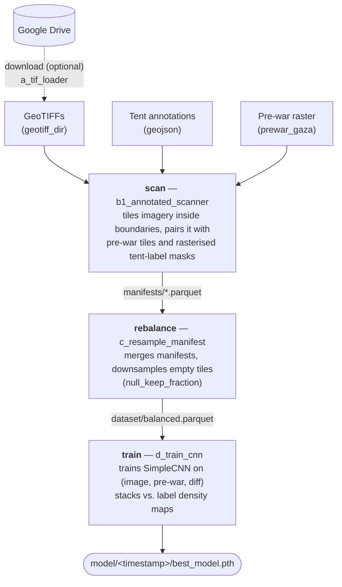
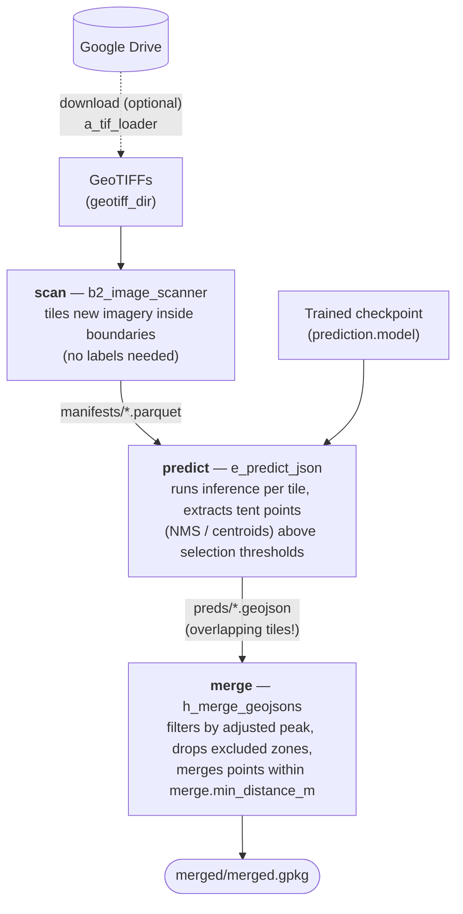

# TentNetFA pipelines

TentNetFA detects tents in Planet satellite imagery of the Gaza Strip with a
pixel-wise CNN. Two end-to-end pipelines cover the full workflow: **training**
builds a model from annotated imagery, **prediction** applies a trained model
to new imagery and produces a deduplicated GeoPackage of tent locations.

Every run is self-contained: the runner resolves your configuration, writes it
into a fresh run directory with fixed subfolder names, and executes the
selected stages against it.

```
<run root>/<pipeline>/<run name>/
    config.yaml     fully resolved config used by every stage
    logs/           one log file per stage
    manifests/ preds/ merged/     (prediction)
    manifests/ dataset/ model/    (training)
```

## Pipeline diagrams

### Training pipeline (`config.yaml`)



### Prediction pipeline (`predict_config.yaml`)



Stages can be toggled individually in the sidebar — e.g. re-run only
*predict* + *merge* against manifests from an earlier run by pointing the
advanced YAML overrides at that run's folders, or skip *merge* while tuning
selection parameters.

## Configuration reference

Paths may reference environment variables as `${VAR}` (resolved from `.env`);
`${DATA_DIR}` is the conventional data root. Keys marked **runner-managed**
are overwritten by the pipeline runner so all artifacts land in the run
directory — setting them yourself only matters when running stage CLIs
manually.

### Shared inputs (both pipelines)

| Key | Role |
|---|---|
| `geotiff_dir` | Directory containing the input GeoTIFF satellite images. The download stage writes here; the scan stages read from here. |
| `loading.files` | List of filename substrings. The download stage uses them as Google Drive search strings (empty = download nothing); the scan stages use them as filters (empty = scan **all** `.tif` files). |
| `boundaries` | Gaza municipal boundaries shapefile; tiles outside it are skipped. |
| `prewar_gaza` | Pre-war reference raster. Each tile is paired with the matching pre-war crop; the model sees (current, pre-war, difference). |
| `manifest_folder` | Where per-image tile manifests are written/read. **Runner-managed** → `manifests/`. |

### Processing (tiling)

| Key | Role |
|---|---|
| `processing.core_metres` | Side length (m) of a tile's core area — the region whose predictions/labels count. |
| `processing.margin_metres` | Extra context (m) around the core; tiles overlap by this margin. Also drives the prediction crop (`crop_pixels`) and NMS sigma. |
| `processing.quality_thresholds.min_valid_fraction` | Minimum non-black/NaN fraction for a tile to be kept (train: strict ~0.9; predict: loose ~0.1). |
| `processing.max_workers`, `max_tasks_per_child`, `max_pool_restarts` | Scan parallelism (training scanner). |
| `processing.complete` | Filenames processed in full, ignoring quality gates. |

### Training pipeline

| Key | Role |
|---|---|
| `geojson` | Tent-annotation snapshot (Forensic Architecture labels) rasterised into label masks. |
| `rebalancing.null_keep_fraction` | Fraction of empty (tent-free) tiles kept when balancing the dataset. |
| `rebalancing.rng_seed` | Seed for that downsampling. |
| `rebalancing.out`, `manifest` | Balanced dataset location. **Runner-managed** → `dataset/balanced.parquet`. |
| `training.checkpoint` | Optional `.pth` to resume from (empty = train from scratch; `model_kwargs` are then ignored). |
| `training.device` | `cuda` or `cpu`. |
| `training.epochs`, `batch_size`, `learning_rate` | Optimisation parameters. |
| `training.training_frac`, `validation_frac` | Dataset split fractions (remainder becomes a held-out test set). |
| `training.memory` | Cache the dataset in RAM for faster epochs. |
| `training.num_workers` | Data-loader workers. |
| `training.model_kwargs.kernel_size` | CNN kernel size (fresh models only). |
| `artifact_dir` | Where `<timestamp>/best_model.pth` + split info land. **Runner-managed** → `model/`. |
| `metadata_embedding.*` | Config for the separate `train-embedding` CLI; not part of this pipeline. |

### Prediction pipeline

| Key | Role |
|---|---|
| `prediction.model` | Trained checkpoint (`best_model.pth`) to run inference with. |
| `prediction.batch_size`, `num_workers` | Inference batching / data-loader workers. |
| `prediction.per_tile_standardisation` | Standardise each tile individually instead of per-raster. |
| `prediction.sample.enable`, `size`, `seed` | Predict only a random sample of tiles (for quick checks). |
| `prediction.validation_tifs` | Also write prediction rasters for visual validation (keep off for full runs). |
| `prediction.selection.method` | Point extraction: `nms` (local maxima) or `centroid` (blob centroids). |
| `prediction.selection.threshold` | Minimum score for a detection. |
| `prediction.selection.factor` | Weight of the blurred score added during NMS (adjusted peak). |
| `prediction.selection.min_area` | Minimum blob area / NMS pooling size in pixels. |
| `prediction.selection.min_distance_m` | Minimum distance between extracted points. |
| `prediction.input_folder`, `output_folder` | Manifest input / GeoJSON output. **Runner-managed** → `manifests/`, `preds/`. |
| `merge.min_distance_m` | Points closer than this (m) are merged into one tent. |
| `merge.agreement` | Minimum cluster size to keep after merging (overlapping tiles vote). |
| `merge.min_adj_peak` | Global adjusted-peak threshold applied before merging. |
| `merge.adjustment_factor` | Factor applied to (adjusted_peak − peak) when filtering. |
| `merge.thresholds_config` | Optional YAML with per-file adjusted-peak thresholds. |
| `merge.exclusion_zones_gpkg`, `inclusion_zone` | Drop points inside / outside these geometries. |
| `merge.output` | Final GeoPackage. **Runner-managed** → `merged/merged.gpkg`. |

### Anything else

Every config key can be overridden — parameters not exposed as form fields go
in **Advanced: extra YAML overrides** (Configuration tab), which is
deep-merged over the base config last.
